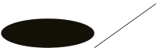
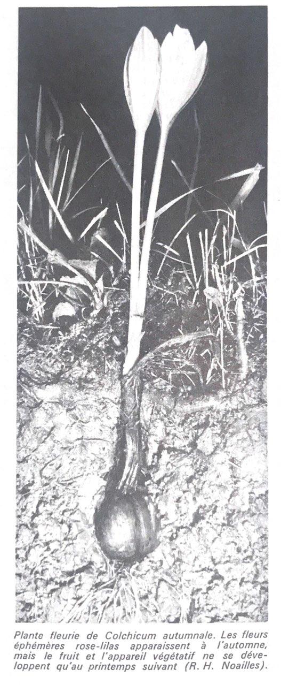

  

## ./ (root)

[ Ongoing implementation ] → [`…/1_1_Program`](1-1-Program/README.md)

./ (root) is an an ongoing experimental server project. We consider the fact that it is always in construction and therefore accept updates. Actually ./ (root) is hosted somewhere in the cloud ☁︎ in a research phase waiting to be implanted in the ground. 

✺ 
*This temporary github space tends to bring together the research done in the cloud and our personal workspaces, pending the production of a format that brings together and presents all these materials in a coherent whole regarding the project.*

[Archive] Precedently we made a try to gather some researsh elements on an [are.na](https://www.are.na/root/index) space, unconvince by it's form at the moment. ( may it can be used in another way later or be a complement to archive specifics … ) 

### Table of Contents 

*[Tbd]*

## Introduction

  

    
    *The root system of a plant.*
       
         *The beginning of a file path* 

    *./ (root) is not in the cloud*
        
                *./ (root) is geo-connected  to the ground*

./ (root) is a hybrid and nomadic[^1] tool[^2], it includes a software component, paired with a physical one. - It is designed to meet, collect, gather, document, edit and publish from a local environment, a wide range of materials (such as interviews, artifacts, events and manufactured objects) forming an atlas, a weaving of personal histories, a corpus of singular and collective knowledge related to a territory. Participatory and experimental in nature, ./(root) is grounded in community learning and aims to engage a multiplicity of voices in the production of meaning and the dissemination of knowledge.

  The ./ (root) project has grown out from a desire to connect with others as designer and language interests around computer science and network systems, especially around the polysemy of the lexical field. Servers, requests, domains, transfer protocols, access paths, data formatting, networks, window, format, hosting, infrastructure…

  Spinning this polysemy, ./ (root), is meant to be a long term project, which during multiple implementations, imagines the shifting and materialization of network communication protocols.

## The protocol 

### 1. Request to access a domain

The contact phase. The starting point.

We get in contact by adressing a [request](more/request.md) (a written solicitation addressed to someone with authority to make a decision). in order to establish the authorisation and the outlines of the implementation, its duration, the course of the implementation and its potential financing. If the request is accepted the protocol follows its path, and move on to the next phase.

### 2. Locate the datas

The havesting, collecting, encountering, gathering phase. 

We implement the [server](more/server.md). From this anchorage we will proliferate in a rhizomatic way the operations of land surveying, close observations, harvests to localize, select, gather and collect personnal histories, singular and collective knowledge(s) related to the locality.

[+ How we collect, how we select .](more/locate-the-data.md)

### 3. Datas formatting

The formatting phase, editing phase. 

The mass of data and information(s) resulting from the location and collection phase are put into perspective so that they can be formatted. That is to say, they are arranged, sorted and augmented by the practice of design so that they inform a form[^3]. The form is a container that will only be defined by its content, its in-formation, here the datas predently gathered.

### 4. Send back a response that displays the result of the request

The displaying phase. 

Display result on an interface, a space, a place of interaction, a junction planes between two systems, here ./ (root) and the local inhabitants. 
The result, here, will be exhibited in two ways: on the one hand via a consultation [interface](more/interface.md) accessible through a local area network accessible by wifi all along the implementation and during a moment of shared restitution, a convivial meal...

./ (root) is a self-initiated project imagined by Maya Cunat & Quentin Gaudry, who work as a collective under the name Atelier Nom Commun.

[^1]: *The nomad does not ask himself the question of the beginning or the end of the journey. The difference between nomadism and the state is the way in which space is occupied. Moreover, nomads favour tuber-based agriculture as opposed to the cereal-based monoculture that is typical of the state. Cereals are adapted to tax collection, they are visible, divisible, easily assessed plants that can be stored and harvested at fixed times of the year, which is not the case for tubers and rhizomes.* Deleuze, G. & Guattari, F. (1980) Mille Plateaux, “Traité de nomadologie”
[^2]: *The solution to the crisis requires a radical volte-face: only by overturning the profound structure that regulates the relationship between man and tool can we give ourselves the right tools. The right tool meets three requirements: it generates efficiency without degrading personal autonomy, it does not give rise to slaves or masters, and it widens the scope of personal action. Man needs a tool to work with, not a tool to work for him. He needs a technology that makes the most of personal energy and imagination, not a technology that enslaves and programs him.* Illich, I. (1973) Tools for conviviality. London: Calder and Boyars.
[^3]:The heavy suffix -at, taken from the Italian past participle *formato*, added to the word form, gives it something more immanent and tangible. Format is more of a medium, a support, something that concretises information by imposing certain constraints. Alain Rey reminds us that the format - in computing, but in our opinion not only - is a "model defining the rules to be observed for the dimensions of information and its arrangement ".  In a way, the format is a medium which Régis Debray assures us is at the same time message - status, qualifying point of locution -, medium - means of transmission -, environment - the strictly ecological environment of the life of messages and signs, with their families, their great predators - and mediation - the productive effect of this relationship. Chancogne, T. Format (https://www.t-o-m-b-o-l-o.eu/flux/format/) 
